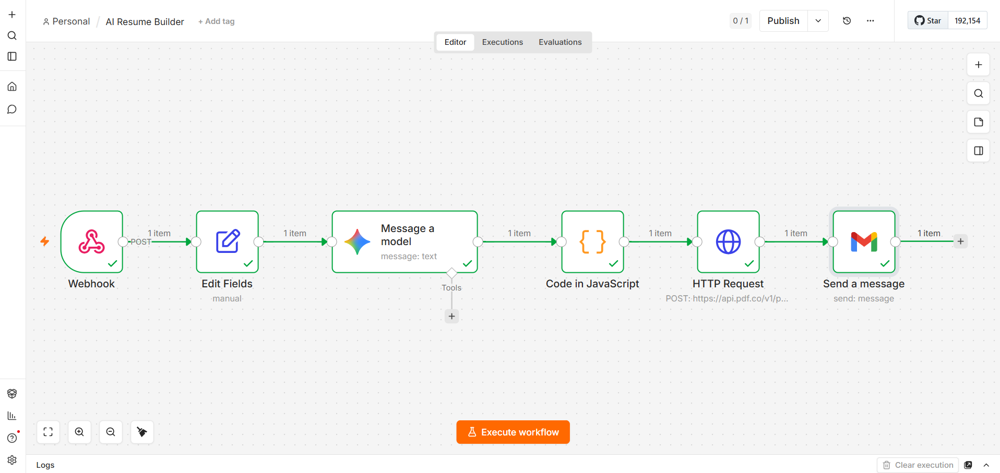
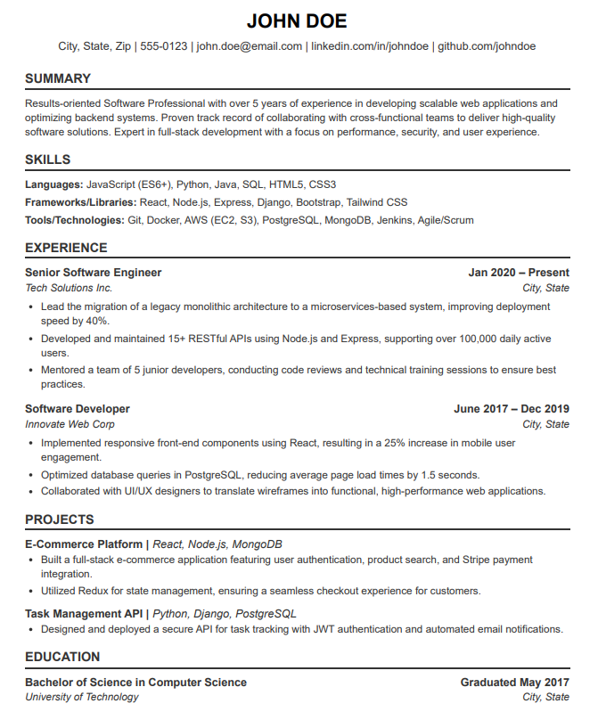

# 🚀 AI Resume Builder using n8n & Gemini AI

> Generate professional ATS-friendly resumes automatically using AI, PDF generation, and email automation.


---

## 📌 Overview

**AI Resume Builder** is an end-to-end automation workflow built with **n8n**, **Google Gemini AI**, and **Email Automation**.

The workflow collects user information, generates a professional ATS-friendly resume using AI, converts it into a PDF, and automatically delivers it to the user's email.

---

## 🎥 Demo

### Workflow Execution

1. User submits resume details
2. n8n webhook receives data
3. Gemini AI generates ATS-friendly resume
4. PDF is automatically created
5. Resume is delivered via email

**Final Output:** Professional PDF resume sent directly to the user's inbox.

---

## ✨ Features

- AI-Powered Resume Generation via Google Gemini
- ATS-Friendly Resume Formatting
- Automated PDF Creation
- Email Delivery Automation
- Webhook-Based Data Collection
- End-to-End Workflow Automation
- No Manual Resume Formatting Required

---

## 🏗️ Workflow Architecture

```text
User Input
      ↓
Webhook
      ↓
Set Fields
      ↓
Gemini AI
      ↓
JavaScript Processing
      ↓
PDF Generation API
      ↓
Email Delivery
```

---

## 🛠️ Tech Stack

| Technology | Purpose |
|------------|---------|
| n8n | Workflow Automation |
| Gemini AI | Resume Generation |
| JavaScript | Data Processing |
| REST APIs | External Integrations |
| PDF Generation API | PDF Creation |
| Gmail | Email Automation |
| Webhooks | Data Collection |

---

## 📥 Input Data

Users provide the following details via webhook:

| Field | Description |
|---------|------------|
| Name | Candidate Full Name |
| Email | Resume Delivery Email |
| Education | Academic Background |
| Skills | Technical & Soft Skills |
| Projects | Academic / Personal Projects |
| Experience | Work Experience or Fresher Status |

### Example Payload

```json
{
  "name": "John Dae",
  "email": "john.dae@email.com",
  "education": "B.Tech CSE",
  "skills": "Java, Python, SQL",
  "projects": "AI Resume Builder",
  "experience": "8+ yrs experience"
}
```

---

## 📤 Output

| Deliverable | Description |
|-------------|-------------|
| Professional Resume | AI-generated content |
| ATS-Friendly Format | Optimized for recruitment systems |
| PDF Document | Ready-to-submit resume |
| Email Delivery | Automatically delivered to inbox |

---

## 📸 Workflow Screenshot

> Upload your workflow image to the repository and ensure it is located inside the `screenshots` folder.



---

## 📄 Sample Generated Resume

> Upload a screenshot of a generated resume inside the `screenshots` folder.



---

## 🎯 Skills Demonstrated

### AI Engineering
- Prompt Engineering
- Gemini AI Integration
- AI Workflow Design
- Resume Content Generation

### Automation
- Workflow Automation with n8n
- Event-Driven Architecture
- Business Process Automation
- End-to-End Workflow Orchestration

### Development
- JavaScript Data Transformation
- API Integration
- JSON Data Processing
- Error Handling & Workflow Logic

### Cloud & Integration
- Gmail Integration
- Webhook Development
- PDF Generation APIs
- Third-Party Service Integration

---

## 📚 What I Learned

- Building AI-powered applications using Gemini AI
- Integrating and orchestrating multiple APIs
- Designing scalable automation workflows
- Processing and transforming structured data
- Automating PDF document generation
- Delivering complete end-to-end AI solutions
- Building production-ready workflow automation systems

---

## 💡 Project Impact

This project demonstrates how Generative AI can be integrated into real-world business workflows to automate document creation and delivery.

By combining AI, workflow automation, PDF generation, and email integration, the solution eliminates manual resume formatting and significantly reduces the time required to create professional resumes.

---

## 🚀 Future Enhancements

- Multiple Resume Templates
- Resume Score Analysis
- Job Description Matching
- ATS Optimization Suggestions
- Web Application Frontend
- LinkedIn Profile Import
- Resume Analytics Dashboard
- Multi-language Resume Support

---

## 📂 Repository Structure

```text
ai-resume-builder-n8n/
│
├── README.md
├── workflow.json
├── LICENSE
│
└── screenshots/
    ├── workflow.png
    └── generated-resume.png
```

---

## 👨‍💻 Author

AI & Automation Enthusiast

Passionate about building practical AI-powered automation solutions using n8n, APIs, JavaScript, and Generative AI.

---

## 🏷️ Repository Topics

`n8n` `gemini-ai` `automation` `workflow-automation` `resume-builder` `artificial-intelligence` `javascript` `pdf-generation` `gmail-api` `webhooks`
